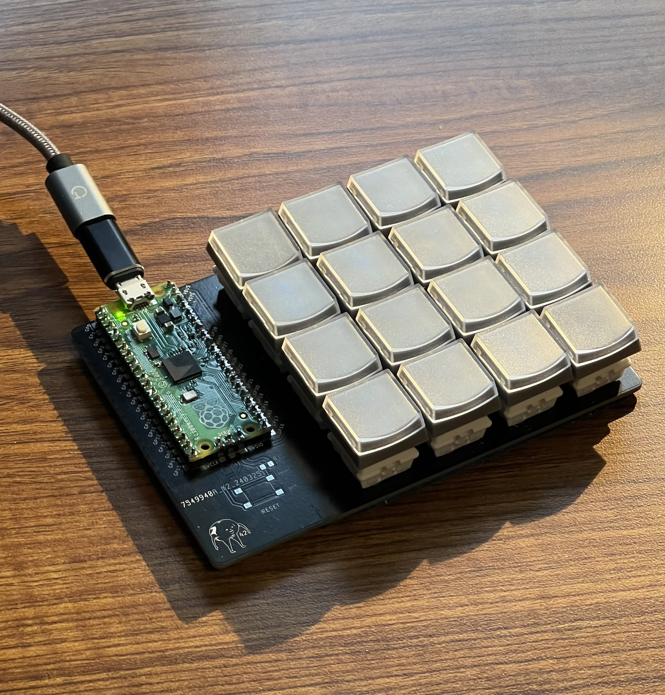
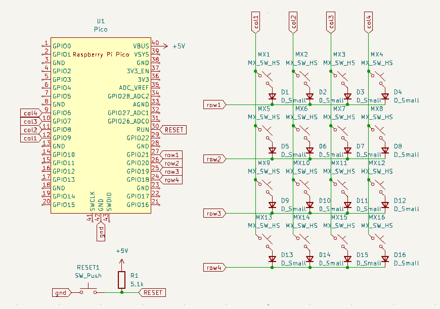
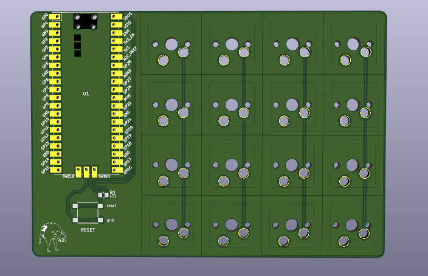
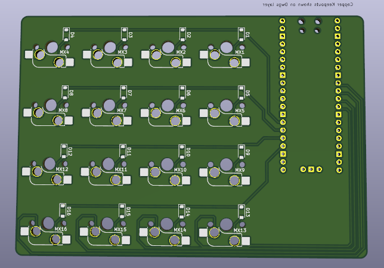

<h1 align="center"> Macropad </h1>

## Table of Contents
* [Introduction](#introduction)
* [Macropad](#macropad)
    * [Schematic](#schematic)
    * [PCB](#pcb)
    * [Parts](#parts)
* [Firmware](#firmware)
    * [Default mode](#default-mode)
    * [Function mode](#function-mode)
* [Future plans](#future-plans)

## Introduction

Greetings, It seems you've stubbled upon my macropad project :)!
Utilizing everything provided from this repo (with a few exceptions) you should be able to make this simple 4x4 macropad using a Pi Pico:

    

Now I must set some ground rules and mentions those exceptions from the previous text. 
This repo assumes you have knowledge of:

* [Python](https://www.python.org/)
* [Kicad](https://www.kicad.org/)
* [CircuitPython](https://circuitpython.org/) - This should be installed on your Pi Pico

The next two sections will discuss what the two folders, Macropad and Firmware, in this project do.

## Macropad

All the project files (schematic, pcb, and fingerprints) should be in this folder. When opening this within Kicad, you will most likely need to reassign the location of the fingerprints.

##### Schematic:

    

##### PCB:

    
    

##### Parts:
* 16 Kahlil hotswap sockets
* 1 Raspberry Pi Pico
* 16 SMD Diodes
* Header pins for the pico (optional)
* Micro usb wire
* Soldering kit

Here's a [spreadsheet](https://docs.google.com/spreadsheets/d/1NUBolih80QTXxrNlfvGj-lknc-THMJnu64dy0pHb7lM/edit?usp=sharing) containing all the items I used. This spreadsheet doesn't include headers, switches, and keys as I already had these lying around.

<i><b>Sidenote</b>, I left a place for a reset button for convinence, however, this proved to be the complete opposite. The small button got in the way more often than not so the final build doesn't include it. </i>

## Firmware

You will find a <b>lib</b> folder as well as a <b>code.py</b> file in here. The <b>lib</b> folder contains the necessary adafruit library needed for the python file <b>code.py</b> which contains the actual firmware code.

The macropad is designed in a 4x4 matrix with the following pins:

* Rows: GP21, GP20, GP19, GP18
* Columns: GP6, GP7, GP8, GP9

The current python file provides you with two modes:
1. [Default mode](#default-mode) - for media controls
2. [Function mode](#function-mode) - for general purpose binds using F13-F21 keys, mainly for binding macros in software (blender, kritia, etc.)

The modes will be presented in tables, each cell being a key. Every cell labeled <i>null</i> means the key is unassigned. Within the actual code this is represented with a -1.

##### Default Mode:

<table>
    <tr>
        <td>VOLUME DECREMENT</td>
        <td>VOLUME INCREMENT</td>
        <td>MUTE VOLUME</td>
        <td>CHANGE MODE</td>
    </tr>
    <tr>
        <td>PREVIOUS TRACK</td>
        <td>PLAY/PAUSE MEDIA</td>
        <td>NEXT TRACK</td>
        <td><i>null</i></td>
    </tr>
    <tr>
        <td><i>null</i></td>
        <td><i>null</i></td>
        <td><i>null</i></td>
        <td><i>null</i></td>
    </tr>
    <tr>
        <td><i>null</i></td>
        <td><i>null</i></td>
        <td><i>null</i></td>
        <td><i>null</i></td>
    </tr>
</table>

##### Function Mode:

<table>
    <tr>
        <td>LEFT SHIFT</td>
        <td>F14</td>
        <td>F15</td>
        <td>CHANGE MODE</td>
    </tr>
    <tr>
        <td>F13</td>
        <td>F17</td>
        <td>F18</td>
        <td>F19</td>
    </tr>
    <tr>
        <td>F16</td>
        <td>F21</td>
        <td>F22</td>
        <td>F23</td>
    </tr>
    <tr>
        <td>LEFT CONTROL</td>
        <td>F20</td>
        <td><i>null</i></td>
        <td>SPACE</td>
    </tr>
</table>

## Future plans

So, whats planned for the future? I've been using this macropad for a couple days now and here's the following things I plan on implementing soon:

1. <b>Proper case</b> - I've created the model, but now just need to get a 3D printer and do some troubleshooting
2. <b>Rotary Encoders</b> - Will be great for volume control and zooming in
3. <b>Standalone LED + Mode button</b> - Just for mode switching
4. <b>IR Sensors</b> - Really looking forward to this one! Plan on adding AC and table height controls using this.

As to what I will remove:
1. <b>The reset button</b> - Honestly made it less comfortable to use
2. <b>Micro usb</b>- Looking to replace this with a USB-C port